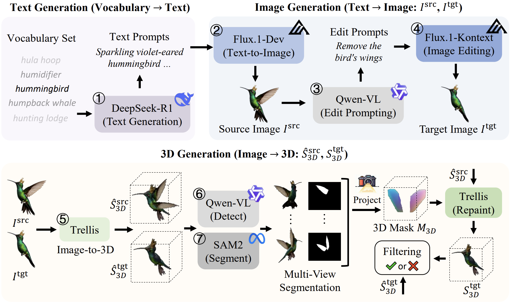
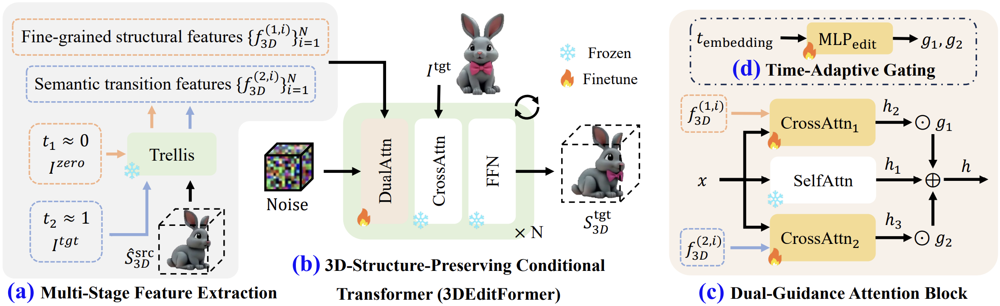

# Towards Scalable and Consistent 3D Editing

<div align="center">
<a href="https://arxiv.org/abs/2510.02994"></a>
<a href='https://www.lv-lab.org/3DEditFormer/'></a>
<a href='https://huggingface.co/XiaRho/3DEditFormer'></a>
<a href='https://huggingface.co/datasets/XiaRho/3DEditVerse'></a>
</div>


*👋 Hi, I’m **Ruihao Xia**, a Ph.D. candidate (expected 2026). I’m seeking internship and full-time opportunities in **AIGC**, **3D vision**, and **multimodal intelligence**. More about me and my CV: [https://xiarho.github.io/](https://xiarho.github.io/) — feel free to reach out if my background aligns with your team!*

In this paper, we introduce **3DEditVerse**, the largest paired 3D editing benchmark, and propose **3DEditFormer**, a mask-free transformer enabling precise, consistent, and scalable 3D edits.

**:sun_with_face: 3DEditVerse**
<p align="center">
  
<br>
Our 3DEditVerse, the largest paired 3D editing benchmark to date, comprising 116,309 high-quality training pairs and 1,500 curated test pairs.
</p>

**:sparkles: 3DEditFormer**
<p align="center">
  
<br>
Our 3DEditFormer, a 3D-structure-preserving conditional transformer, enabling precise and consistent edits without requiring auxiliary 3D masks.
</p>

## :hammer_and_wrench: Environment Setup
1. Our environment setup follows the official **[TRELLIS](https://github.com/microsoft/TRELLIS)** project.  
Please refer to their installation instructions for dependency versions and CUDA/PyTorch configurations.

2. Install the blender: Download from https://download.blender.org/release/Blender4.4/blender-4.4.3-linux-x64.tar.xz and extract it.


## :nut_and_bolt: Preparing the Datasets

Download our 3DEditVerse dataset: https://huggingface.co/datasets/XiaRho/3DEditVerse. About 227 GB (636,569 files).


## :arrow_forward: Inference and Evaluation with our Trained 3DEditFormer

1. Download the trained model of [3DEditFormer](https://huggingface.co/XiaRho/3DEditFormer) and put them in the `./work_dirs/Editing_Training` folder. Then, you can inference on the testing data in 3DEditVerse:
```
CUDA_VISIBLE_DEVICES=0 python eval_3d_editing.py --cuda_idx 0 --world_size 1 --rank 0 --dataset_root_dir /path_to_3DEditVerse/3DEditVerse --blender_path /path_to_blender/blender-4.4.3-linux-x64/blender --ss_latents_load_id img_to_voxel --latents_load_id voxel_to_texture --save_name 3DEditFormer --output_mesh --output_video --print_time
```
* In the above command, replace `/path_to_3DEditVerse/3DEditVerse` with the path to your 3DEditVerse dataset and `/path_to_blender/blender-4.4.3-linux-x64/blender` with the path to your blender. `CUDA_VISIBLE_DEVICES=0` means the GPU index for model inference, `--cuda_idx 0` means the GPU index for image rendering with blender.
* You can change the `--world_size` and `--rank` to inference the model on multiple GPUs, i.e., run the command with the same `--world_size 4` and different `--rank 0/1/2/3` on 4 GPUs.

2. Calculate the 2D metrics based on the rendered images (rendered from predicted 3D meshes):
```
CUDA_VISIBLE_DEVICES=0 python calculate_metric_2d.py --eval_results_dir ./work_dirs/eval_results/3DEditFormer --dataset_root_dir /path_to_3DEditVerse/3DEditVerse
```
* The metrics will be saved in `./work_dirs/eval_results/3DEditFormer/eval_metric.json`.

3. Calculate the 3D metrics based on the predicted 3D meshes:
```
CUDA_VISIBLE_DEVICES=0 python calculate_metric_3d.py --eval_results_dir ./work_dirs/eval_results/3DEditFormer --dataset_root_dir /path_to_3DEditVerse/3DEditVerse
```
* The metrics will be saved in `./work_dirs/eval_results/3DEditFormer/eval_metric.json`.


## :desert_island: Training 3DEditFormer with our 3DEditVerse

1. The first stage: generation of coarse voxelized shapes
```
CUDA_VISIBLE_DEVICES=0,1,2,3 torchrun --nproc_per_node=4 --master_port=12349 train_torchrun.py --config configs/editing/ss_flow_img_dit_L_16l8_fp16.json --data_dir /path_to_3DEditVerse/3DEditVerse --output_dir ./work_dirs/Editing_Training/img_to_voxel_01 --random_cond_gt --train_only_editing_weights --lr 0.0001 --max_steps 40000 --batch_size_per_gpu 4 --random_ori_edit 0.15 --simple_edit_data_if_filtered
```

2. The second stage: generation of fine-grained texture
```
CUDA_VISIBLE_DEVICES=0,1,2,3 torchrun --nproc_per_node=4 --master_port=12349 train_torchrun.py --config configs/editing/slat_flow_img_dit_L_64l8p2_fp16.json --data_dir /path_to_3DEditVerse/3DEditVerse --output_dir ./work_dirs/Editing_Training/voxel_to_texture_01 --random_cond_gt --train_only_editing_weights --lr 0.0001 --max_steps 40000 --batch_size_per_gpu 4
```

## :label: TODO 

- [ ] Interactive 3D editing demo.
- [ ] Visualize the 3DEditVerse dataset.

## :hearts: Acknowledgements

Thanks [TRELLIS](https://github.com/microsoft/TRELLIS), [VoxHammer](https://github.com/Nelipot-Lee/VoxHammer) for their public code and released models.


## :black_nib: Citation

If you find this project useful, please consider citing:

```bibtex
@article{3DEditFormer,
  title={Towards Scalable and Consistent 3D Editing},
  author={Xia, Ruihao and Tang, Yang and Zhou, Pan},
  journal={arXiv:2510.02994},
  year={2025}
}
```